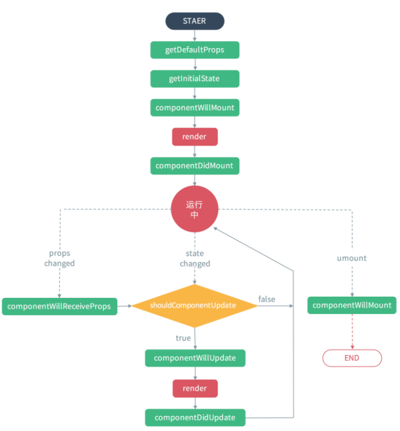
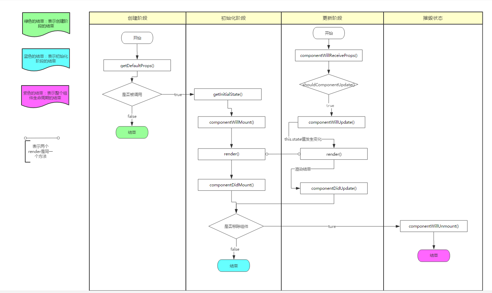
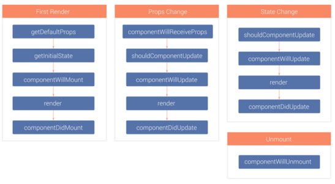

# 流程／原理图

# 生命周期图片

# SimpleLifeCycle 案例生命周期
程序启动时:
- constructor()
- componentWillMount()
- fetchData()
- render()
- componentDidMount()
  
当点击testStateLifecycle按钮时 (本质是state更新的生命周期) :
- testStateLifecycle()
- shouldComponentUpdate()
- componentWillUpdate()
- render()
- componentDidUpdate()

# FullLifeCycl 案例生命周期
程序启动时：
- constructor()
- componentWillMount()
- fetchData()
- render()
- 此处进入子组建的生命周期
- constructor()
- componentWillMount()
- render()
- componentDidMount()
- 结束子组建的生命周期，回到父组件
- componentDidMount()

当点击testStateLifecycle按钮时 :
- FullLifeCycle testStateLifecycle()
- FullLifeCycle shouldComponentUpdate()
- FullLifeCycle componentWillUpdate()
- FullLifeCycle render()
-   此处进入 ListView Props 生命周期
-   MyListView componentWillReceiveProps()
-   MyListView shouldComponentUpdate()
-   MyListView componentWillUpdate()
-   MyListView render()
-   MyListView componentDidUpdate()
-   此处结束 ListView Props 生命周期
- FullLifeCycle componentDidUpdate()

# React Native技术交流群
- 555705178

# YZMobileTalks博客
- www.52learn.wang

# YZMobileTalks公众号

